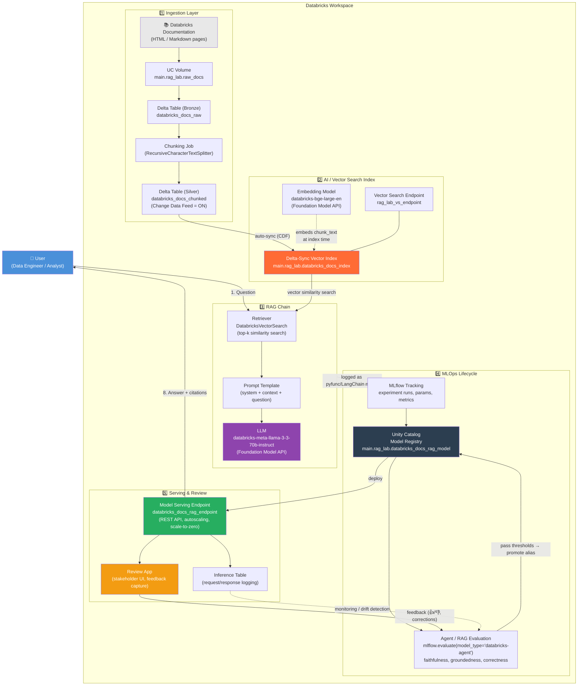

# Architecture — Databricks RAG Pipeline for Databricks Documentation Q&A

## 1. Mermaid Diagram



## 2. ASCII Architecture Diagram

```
                                   ┌────────────────────────────────────────────────────────┐
                                   │                        USER                             │
                                   │           "How do I create a Delta Live Table?"          │
                                   └───────────────────────────┬──────────────────────────────┘
                                                                │ (1) question
                                                                ▼
┌───────────────────────────────────────────────────────────────────────────────────────────────────┐
│                                     DATABRICKS  WORKSPACE                                            │
│                                                                                                       │
│  ┌───────────────────── INGESTION (offline / batch) ─────────────────────┐                          │
│  │  Databricks Docs (HTML/MD)  →  UC Volume  →  Bronze Delta Table         │                          │
│  │        →  Chunking (LangChain splitter)  →  Silver Delta Table          │                          │
│  │             (databricks_docs_chunked, Change Data Feed = ON)            │                          │
│  └───────────────────────────────────┬───────────────────────────────────┘                          │
│                                       │ auto-sync                                                     │
│                                       ▼                                                               │
│  ┌───────────────────────── AI / VECTOR SEARCH ──────────────────────────┐                            │
│  │   Embedding Model (databricks-bge-large-en)                             │                          │
│  │        ▼                                                                │                          │
│  │   Vector Search Endpoint (rag_lab_vs_endpoint)                          │                          │
│  │        ▼                                                                │                          │
│  │   Delta-Sync Index: main.rag_lab.databricks_docs_index                  │                          │
│  └───────────────────────────────────┬───────────────────────────────────┘                          │
│                                       │ (2) embed query → (3) top-k ANN search                        │
│                                       ▼                                                               │
│  ┌────────────────────────────── RAG CHAIN ──────────────────────────────┐                            │
│  │   Retriever  →  (4) Top-k Chunks  →  Prompt Assembly (system+ctx+Q)     │                          │
│  │                                              │                          │                          │
│  │                                              ▼                          │                          │
│  │                          LLM (databricks-meta-llama-3-3-70b-instruct)   │                          │
│  │                                              │ (5) generated answer     │                          │
│  └──────────────────────────────────────────────┼───────────────────────┘                            │
│                                                   ▼                                                    │
│  ┌───────────────────────────── MLOPS  LIFECYCLE ────────────────────────┐                            │
│  │   MLflow Tracking (params/metrics/artifacts)                          │                            │
│  │        ▼                                                               │                           │
│  │   Unity Catalog Model Registry (main.rag_lab.databricks_docs_rag_model)│                            │
│  │        ▼                                                               │                           │
│  │   Evaluation Framework (mlflow.evaluate, Agent Evaluation)             │                            │
│  │        - retrieval precision/recall   - faithfulness                  │                            │
│  │        - groundedness                 - answer correctness            │                            │
│  │        - context relevance            - latency (p50/p90)             │                            │
│  │        ▼  (pass thresholds → set alias "champion")                    │                             │
│  └────────────────────────────────────┬───────────────────────────────┘                              │
│                                        ▼                                                              │
│  ┌────────────────────────── SERVING & REVIEW ──────────────────────────┐                            │
│  │   Model Serving Endpoint (REST, autoscale, scale-to-zero)             │                             │
│  │        │                                     │                        │                            │
│  │        ▼                                     ▼                        │                            │
│  │   Review App (human eval UI)          Inference Table (logging)       │                            │
│  └────────────────────────────────────┬──────────────────────────────────┘                            │
│                                        │ (6) answer + citations                                        │
└────────────────────────────────────────┼──────────────────────────────────────────────────────────────┘
                                          ▼
                                   ┌────────────────────┐
                                   │        USER         │
                                   │   sees final answer  │
                                   └────────────────────┘
```

## 3. Component-by-Component Explanation

| # | Component | Databricks Feature | Role in the RAG Architecture |
|---|-----------|--------------------|-------------------------------|
| 1 | **User** | — | Issues natural-language questions about Databricks (via Review App, REST API, or a downstream chat UI). |
| 2 | **Databricks Documentation** | External corpus, landed via UC Volume | The knowledge base. Static HTML/Markdown pages scraped or exported, stored as files so they are versioned and reproducible. |
| 3 | **Bronze/Silver Delta Tables** | Delta Lake, Unity Catalog managed tables | Bronze = raw 1 row/page. Silver = chunked, cleaned text with metadata (url, title, chunk_id). Delta gives ACID writes, time travel, and — critically — **Change Data Feed**, which the Vector Search index uses for incremental sync. |
| 4 | **Embedding Model** | Databricks Foundation Model APIs (`databricks-bge-large-en`) | Converts chunk text (at index time) and the user's question (at query time) into dense vectors in the same embedding space. Using a Databricks-hosted endpoint means no external API key and no egress. |
| 5 | **Vector Search Endpoint + Index** | **Mosaic AI Vector Search** | The "AI Search Index" required by the lab. A serverless compute endpoint hosts one or more indexes; the index does ANN (approximate nearest neighbor) similarity search over embeddings, with automatic re-sync whenever the Silver Delta table changes. |
| 6 | **Retriever** | `databricks-langchain`'s `DatabricksVectorSearch` (LangChain `VectorStore`/`Retriever` interface) | Wraps the index behind a standard `.invoke(query)` → `List[Document]` interface so it can be composed into a chain. |
| 7 | **Prompt Construction** | LangChain `ChatPromptTemplate` | Assembles a system instruction, the retrieved context chunks, and the user's question into the exact input the LLM expects. This is where grounding rules ("answer only from context") live. |
| 8 | **LLM** | Databricks Foundation Model APIs (`databricks-meta-llama-3-3-70b-instruct`, or Claude via Databricks) | Generates the final natural-language answer conditioned on the retrieved context. |
| 9 | **RAG Pipeline / Chain** | LangChain Expression Language (LCEL) `Runnable` | Wires retriever → prompt → LLM → output parser into one composable, streamable object. This *is* "the model" that gets logged to MLflow. |
| 10 | **MLflow Tracking + Model Registry** | MLflow (managed, backed by Unity Catalog) | Logs the chain as a versioned artifact (`mlflow.langchain.log_model`), tracks parameters/metrics per run, and registers it under a 3-level UC name for governance (access control, lineage, environments via aliases). |
| 11 | **Evaluation Framework** | `mlflow.evaluate(model_type="databricks-agent")` / Mosaic AI Agent Evaluation | Runs the registered model against a golden Q&A/context dataset and scores retrieval + generation quality using LLM-judges and classic IR metrics. |
| 12 | **Model Serving Endpoint** | Databricks Model Serving | Hosts the registered model version behind an autoscaling REST endpoint, with built-in inference-table logging and scale-to-zero for cost control. |
| 13 | **Review App** | Mosaic AI Agent Framework Review App | A pre-built web UI (auto-provisioned by `agents.deploy()`) that lets non-technical stakeholders chat with the deployed agent and leave 👍/👎 + free-text feedback, which flows back into evaluation datasets. |

## 4. Data Flow Summary

```
User Question
      │
      ▼
Embedding (query encoded with the SAME model used to embed the corpus)
      │
      ▼
Vector Search (ANN similarity search over the Delta-Sync index)
      │
      ▼
Top-k Documents (chunks + metadata: url, title, section)
      │
      ▼
Prompt Assembly (system prompt + numbered context blocks + question)
      │
      ▼
LLM (Foundation Model API call, temperature ~0.1 for grounded output)
      │
      ▼
Generated Answer (with citations back to source URLs)
      │
      ▼
Evaluation (offline: mlflow.evaluate — online: Review App feedback + inference table)
      │
      ▼
Deployment (Model Serving endpoint serves this exact chain to real traffic)
```
